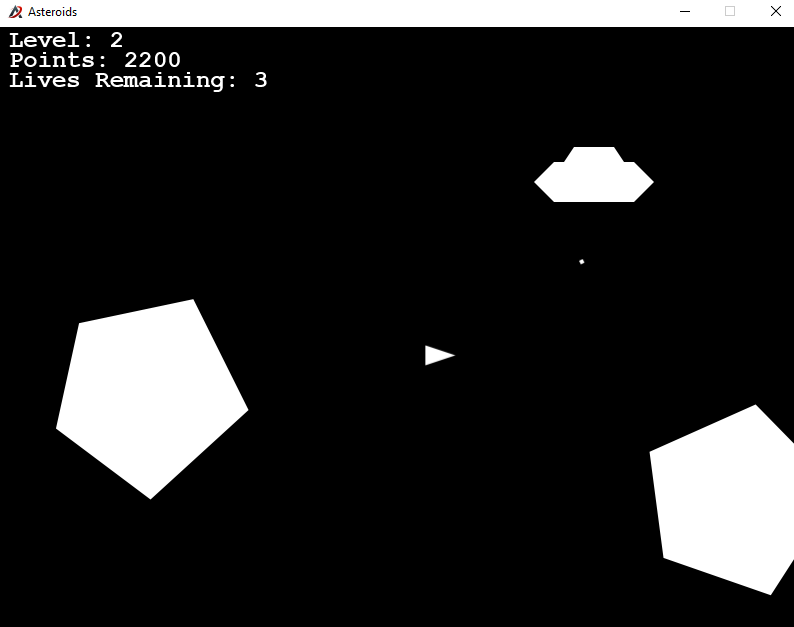

# COMP30820 - Asteroids

## Introduction:
A version of the classic arcade game "Asteroids" built in Java. Part of the module COMP30820 - Java Programming.

## Authors:
- Michael Davitt - michaeldavitt
- Michael Scallon - Michael-scallon
- Hongpeng Zhang - HONGPENGZHANGV

## Description:
### Main Menu:
When the user starts the game, they are greeted with a main menu screen, which provides them with an option to start the game, or to view the game's controls

### Controls Screen
The controls screen tells the user the keys they should press to interact with the game. The player's character will be a spaceship, so the controls screen tells them how to rotate the ship, apply thrust, and perform a hyperspace jump (random teleportation to a new location on the screen).

The player is presented with two options for proceeding on this screen. They can either start the game immediately, or return to the main menu.

### Level Screen
When the user opts to start the game, they are greeted with a level screen. This screen announces what level they are on, and they are given the option to press enter to continue. Once they press enter, they will be taken to the game screen representing the next level that they have to complete.

This level screen will be displayed each time the user completes a level.

### Game Screen
The game screen is the primary screen that the player will be interacting with. It is where all of the gameplay takes place. The user's objective on this screen is to control a spaceship which is currently being attacked by both asteroids and enemy ships. The user must destroy all asteroids and enemy ships before they can reach the next level. Each level increases in difficulty proportionally. 

The user has the ability to move their ship, fire bullets at enemy ships, rotate their ship, and hyperspace jump to a random location on the screen.

### Game Over Screen
Once the user has run out of lives, the game ends. The user is then taken to a game over screen, which informs them that the game is over and prompts them to continue to the Enter Name screen.

### Enter Name Screen
On this screen, the user can input their username, and have their username and associated score be added to the scores list. If their score is in the top 5, it will become a high score, and will be displayed to all other players upon completion of the game.

The user will be prompted to sumbit their username and press enter. Upon doing so, they are taken to a View High Scores screen.

### View High Score Screen
On this screen, the user can view the best players in the game, and their associated scores. If the user scored within the top 5 on their attempt, their score will be present in this list. The user will be prompted to press enter to continue. Upon doing so, they will be brought back to the main menu screen for a chance to play again.

